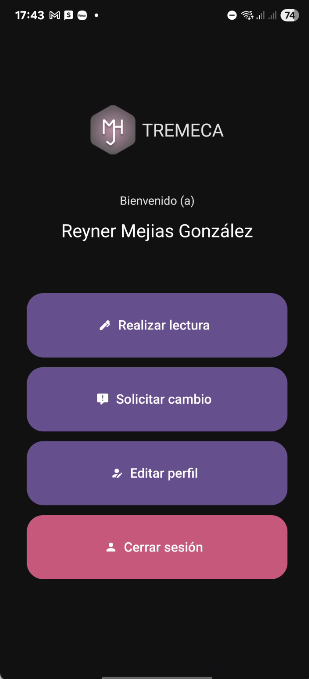

# Tremeca Mobile App – React Native (Expo)
Aplicación móvil desarrollada con React Native conectada al backend Django de Tremeca.
Permite registrar lecturas de agua en campo, visualizar clientes, consultar historial
y generar recibos térmicos mediante impresoras Bluetooth ESC/POS.

## CARACTERÍSTICAS PRINCIPALES
- Pantalla de inicio de sesión
- Lista de clientes por sector
- Registro de nuevas lecturas (con lectura anterior y validación)
- Envío de lecturas al backend Django en tiempo real
- Visualización del historial de consumo
- Generación de recibos (según integración disponible)
- Impresión térmica Bluetooth (ESC/POS)
- Manejo básico offline (si no hay conexión en campo)
- Navegación simple e intuitiva

## Imagen (Pantalla principal):  

## TECNOLOGÍAS UTILIZADAS
- React Native (Expo)
- JavaScript / TypeScript (según tu proyecto)
- React Navigation
- AsyncStorage (si guardás datos localmente)
- fetch nativo para consumir la API
- react-native-thermal-pos-printer (si lo estás usando)

## Imagen (Lista de clientes):

## FUNCIONALIDADES CLAVE
- Consulta de clientes desde el backend
- Registro inmediato de nuevas lecturas
- Cálculo de consumo en la app o usando el backend
- Envío de datos mediante fetch
- Impresión de recibo si hay impresora térmica Bluetooth
- Módulo de historial por cliente
- Flujo rápido para personal de campo

## ENDPOINTS UTILIZADOS
Clientes:
    GET /api/clientes/
    GET /api/clientes/{id}/

Lecturas:
    POST /api/lecturas/
    GET /api/lecturas/{cliente_id}/historial/

Pagos:
    GET /api/pagos/{cliente_id}/

## Imagen (Pantalla de registrar lectura):

## INSTALACIÓN
- npm install
- expo start
